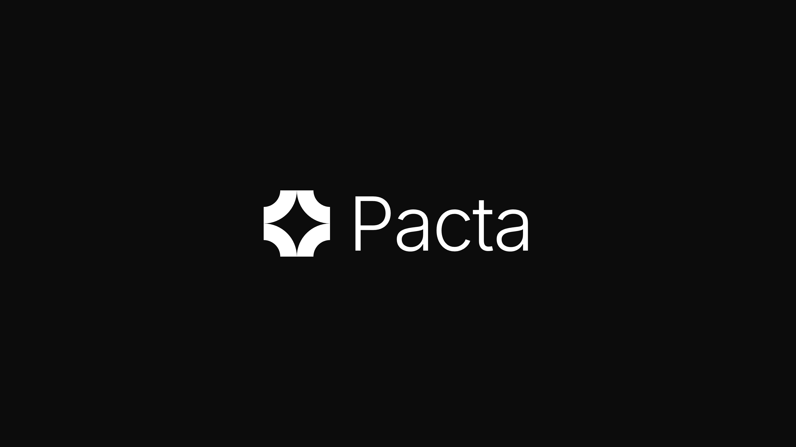
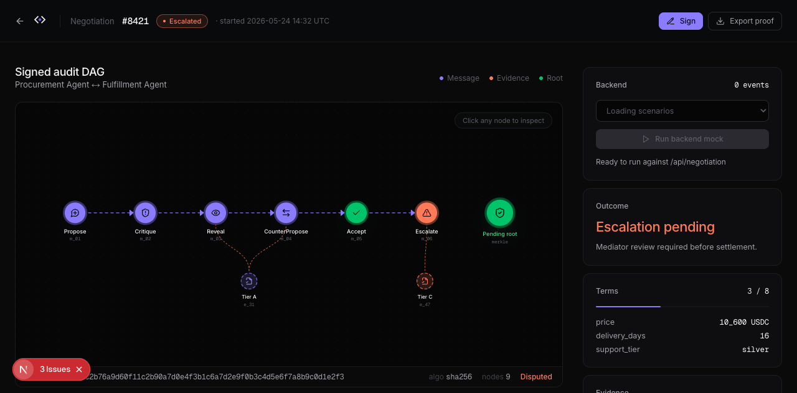

<p align="center">
  
</p>

<p align="center">
  <strong>The agreement layer for autonomous agents.</strong>
  <br />
  A2A made agents talk. MCP gave them tools. x402 let them pay. Pacta is how they agree, even when they don't.
</p>

<p align="center">
  <a href="https://platanus-hack-26-ar-team-5.vercel.app/dashboard"></a>
  <a href="./LICENSE"></a>
  
  
  
</p>

<p align="center">
  
</p>

<p align="center">
  <em>Two AI agents converging on a USD 95k vendor credit, with every move signed and an audit DAG you can verify offline.</em>
</p>

---

## Try it in 30 seconds

**Open the live workbench**
[platanus-hack-26-ar-team-5.vercel.app/dashboard](https://platanus-hack-26-ar-team-5.vercel.app/dashboard)

**Or run it locally** (Node 20, pnpm, optional `ANTHROPIC_API_KEY`):

```bash
git clone https://github.com/platanus-hack/platanus-hack-26-ar-team-5
cd platanus-hack-26-ar-team-5
pnpm install
pnpm demo                             # live with Claude
pnpm demo --mock                      # deterministic, no key, ~1s
pnpm verify tmp/last-run.json         # re-check every Ed25519 signature
```

---

## What it is

The agentic stack got two-thirds of the protocol right. **A2A** standardized how agents discover and message each other; **MCP** standardized how they invoke tools; **ERC-8004** is converging on identity and reputation. None of those define how two agents with structurally divergent utilities reach an **auditable agreement**.

Pacta is that layer.

Two agents (one with technical expertise, one with contractual or regulatory authority) negotiate over a multi-dimensional state space. They cite cryptographically signed evidence, exchange structured offers under a *compromise bound* (utility monotonically non-increasing), and either converge or escalate to a heterogeneous LLM jury. Every message is signed Ed25519 over RFC 8785 canonical JSON. The output is a content-addressed DAG that any third party can verify with a single check.

> Pacta is a deliberation protocol, not a payment protocol. Settlement (x402, AP2, escrow, Stripe) is a downstream integration. The product is the conversation and its audit trail.

---

## How it works

### The six primitives

| Primitive | What it does |
|---|---|
| `Propose` | Offer a candidate state from the agreement space. |
| `Critique` | Challenge a state with cited evidence (no counter required). |
| `CounterPropose` | Reject the current state and offer an alternative inside the schema. |
| `Reveal` | Disclose private info. Binding: you cannot contradict it later. |
| `Accept` | Declare the state meets your reservation value. Signed. |
| `Escalate` | Hand the deadlock to the mediator clause agreed at open. |

### Evidence tiers

| Tier | Meaning | Examples |
|---|---|---|
| **S** | Crypto self-verifying | On-chain tx, counterparty signatures, hashes in the original deal. |
| **A** | Trusted third-party attestation | Chainlink oracle, NEJM paper, signed commit, NCCN guideline. |
| **B** | Self-emitted, signed by the party | Internal logs, transcripts, screenshots. |
| **C** | Pure argumentation | Modulates only. Never decides alone. |

The orchestrator validates the tier claim. A tier-S claim without a valid signature gets downgraded automatically.

### The flow

`Round-robin Propose / Critique / CounterPropose / Reveal / Accept` under compromise-bound enforcement. If the agents converge inside `maxRounds`, the bundle ships with a `converged` outcome. If they deadlock, the dispute escalates to a **three-LLM jury** (Sonnet 4.5 / Opus 4.5 / Haiku 4.5, three personas: Aequitas, Utilis, Velox) that votes with structured outputs and a signed `Ruling`. The whole DAG (evidence + messages + ruling) is bundled with a `root_hash` you can verify offline with `pnpm verify`.

---

## Bundled scenarios

Six end-to-end scenarios ship in the box. Same protocol, different domains.

| id | Parties | Conflict |
|---|---|---|
| `ai-overrun` | SaaS FinOps ↔ AI Provider Account | USD 180k overage from a silent model regression. ToS §8.2 vs MSA committed-spend. |
| `oncology` | Hospital authorization ↔ Insurer adjudication | Stage IIIB NSCLC immunotherapy: upfront durvalumab vs PACIFIC consolidation. |
| `cve-disclosure` | OSS maintainer ↔ Corporate consumer | High-severity CVE in MIT auth lib, 7-day window vs expired commercial agreement. |
| `creative-brief` | Studio creative ↔ Brand stakeholder | Subjective deliverable acceptance under a lax brief. |
| `deadlock-leak` | Whistleblower ↔ Employer counsel | Public-interest leak vs NDA enforcement. Designed to deadlock. |
| `deadlock-fairuse` | AI lab ↔ Creator collective | Training fair-use vs licensing. Designed to split the jury. |

Adding a new scenario is one file in `src/scenarios/<id>.ts` and one line in `src/scenarios/index.ts`. The orchestrator, jury, signing layer and CLI surface are scenario-agnostic.

```bash
pnpm demo --list
pnpm demo --scenario oncology
```

---

## Three ways to drive it

### 1. As a TypeScript library

```ts
import { runPacta } from "pacta";

for await (const event of runPacta({ scenario: "ai-overrun" })) {
  if (event.kind === "message.accepted") {
    console.log(event.role, event.signed.type, event.hash);
  }
  if (event.kind === "bundle") {
    // Merkle root over messages + evidence + outcome.
    console.log("root_hash:", event.bundle.root_hash);
  }
}
```

### 2. As an HTTP endpoint (NDJSON streaming)

```bash
curl https://platanus-hack-26-ar-team-5.vercel.app/api/health
curl https://platanus-hack-26-ar-team-5.vercel.app/api/scenarios

curl -N -X POST 'https://platanus-hack-26-ar-team-5.vercel.app/api/negotiation?scenario=oncology' \
  -H 'content-type: application/json' -d '{}'
```

Query params: `?mock=1` for deterministic replay, `?scenario=<id>` to pick.

### 3. As an MCP server (the real product)

Pacta is also an [MCP](https://modelcontextprotocol.io) server at `/api/mcp` (Streamable HTTP, stateless over Upstash Redis). Any MCP client connects: Claude Desktop, Claude Code, Cursor, custom agents.

#### Authenticating with a Pacta API key

Pacta requires an `X-Pacta-Key` header on every MCP call so token spend gets attributed to a real user (and quotas + the allowlist are enforced). To get a key:

1. Sign in at [platanus-hack-26-ar-team-5.vercel.app/login](https://platanus-hack-26-ar-team-5.vercel.app/login) (locally: `http://localhost:3000/login`) using a Google account that's on the project's allowlist (`ALLOWED_EMAILS` in `.env.local`, or ask an admin to flip `profiles.allowed = true`).
2. Open **Settings → API keys** at `/dashboard/settings`. Click **Mint key**.
3. Copy the key Pacta shows you — the format is `pacta_live_<48 hex>`. Pacta only stores the SHA-256 hash, so this is the **only time** the plaintext is visible. Lose it and you mint a new one.

Now wire the key into your MCP client.

**Claude Desktop / Claude Code** (`~/.config/claude/mcp.json` on macOS/Linux, `%APPDATA%\Claude\mcp.json` on Windows, or via Settings → Developer → Edit Config):

```json
{
  "mcpServers": {
    "pacta": {
      "url": "https://platanus-hack-26-ar-team-5.vercel.app/api/mcp",
      "headers": {
        "X-Pacta-Key": "pacta_live_..."
      }
    }
  }
}
```

**Claude.ai (web — Connectors / Custom integrations):** Settings → Connectors → Add custom connector. URL: `https://platanus-hack-26-ar-team-5.vercel.app/api/mcp`. Add the header `X-Pacta-Key: pacta_live_...`. (`Authorization: Bearer pacta_live_...` works too — Pacta accepts both forms.)

**Local development**: point the URL at `http://localhost:3000/api/mcp`. Claude.ai web cannot reach localhost — for that, run [ngrok](https://ngrok.com) (`ngrok http 3000`) and use the public tunnel URL. Claude Desktop and Claude Code on the same machine can hit localhost directly.

**Note on costs**: the Pacta server pays for Claude turns out of its own `ANTHROPIC_API_KEY`. The `X-Pacta-Key` header gates access and attributes spend back to your account in `/dashboard/usage` — it does NOT charge your Anthropic billing. Per-user BYO Anthropic keys are not implemented yet.

The server publishes an `instructions` block that teaches the agent the autonomous loop: `open` or `join` → `submit_evidence` → if my turn `submit_message` else `wait_for_turn` → repeat → `verify_bundle`. **One human prompt is enough.** Two agents on different machines (different Anthropic accounts, even) negotiate end-to-end without humans typing each turn.

| Tool | Purpose |
|---|---|
| `list_scenarios` / `run_scenario` / `verify_bundle` | Phase 1: stateless. Pacta drives both sides. |
| `open_dispute` / `join_dispute` | Open a schema-less dispute or join an existing one as the second external agent. |
| `submit_evidence` / `submit_message` | Append signed evidence or a primitive (Propose, Critique, etc.) using `eN` / `mN` short refs or raw sha256. |
| `wait_for_turn` | Block server-side until your turn or the dispute finalizes. |
| `get_dispute` | Inspect public state: turn pointer, history, evidence pool, finalized bundle. |

A reference autonomous CLI agent lives at `examples/agent.ts`:

```bash
# Terminal 1 (opener)
pnpm agent --role aria  --open creative-brief
# Terminal 2 (joiner, on a different machine)
pnpm agent --role atlas --dispute-id dsp_…
```

State persists across cold starts via Upstash Redis (`@upstash/redis` over REST). Configure with `UPSTASH_REDIS_REST_URL` + `UPSTASH_REDIS_REST_TOKEN` (or Vercel's `KV_REST_API_URL` + `KV_REST_API_TOKEN`). Without either, Pacta falls back to an in-memory `Map` per process (fine for the CLI demo and unit tests, not for real two-agent flows).

---

## Verifiable by design

Every primitive is a signed node. Every signed node points at its parents. The bundle is a Merkle root over the whole DAG. Re-verification is one command:

```bash
pnpm verify tmp/last-run.json
# exit 0 if every Ed25519 signature checks and the root hash matches
```

The verifier ships in `scripts/verify.ts`. It does not need a network call, an API key, or trust in our server.

---

## Tests

```bash
pnpm test            # full suite, including jury mock and orchestrator e2e
pnpm test:mocked     # only the deterministic ones (no API key needed)
pnpm typecheck       # tsc --noEmit
```

The live LLM test (`tests/scenario.live.test.ts`) is automatically skipped when `ANTHROPIC_API_KEY` is unset. When set, it runs the full AI-overrun negotiation against real Claude and asserts every produced message verifies and every cited evidence hash is real.

---

## Architecture

```
src/
  canonical.ts     RFC 8785 (JCS) canonical JSON + sha256 content-addressing
  crypto.ts        Ed25519 sign/verify (@noble/ed25519, @noble/hashes)
  did.ts           did:key (multibase base58btc + multicodec 0xed01)
  sign.ts          signDoc / verifySignedDoc / docHash
  types.ts         The 6 message primitives, Evidence tiers, Vote, Ruling, Bundle
  orchestrator.ts  Round-robin loop with compromise bound, reveal monotonicity,
                   evidence-ref validation, convergence + deadlock detection
  jury.ts          Three heterogeneous personas on Sonnet 4.5 / Opus 4.5 / Haiku 4.5
  pacta.ts         Public API: runPacta({ scenario, mock }) → Bundle
  mcp_server.ts    JSON-RPC MCP server (Phase 1 + Phase 2 tools)
  dispute_store.ts Stateful disputes over Upstash Redis (or in-memory fallback)
  scenarios/       6 scenarios + the registry

app/
  page.tsx         Public landing
  dashboard/       The workbench (signed audit DAG visualization)
  api/             health · scenarios · negotiation (NDJSON) · mcp (Streamable HTTP)

examples/
  cli-demo.ts      The pnpm demo entrypoint
  agent.ts         Stand-alone autonomous Pacta CLI agent (uses the MCP)

scripts/verify.ts  Independent bundle verifier
```

---

## Roadmap

The protocol surface today is the deliberate MVP cut. Three tiers in [`FUTURE.md`](./FUTURE.md):

- **Pacta Lite** (rule-based, instant, free): structured disputes where the verdict is computable from on-chain or signed sources.
- **Pacta Standard** (3-LLM jury, what ships today): heterogeneous panel with structured outputs and evidence tiering.
- **Pacta Pro** (argumentation graph): LLM extracts claims and attack relations; the verdict is the grounded extension of a Dung framework, deterministic on the extraction.

The honest line between what is real and what is mocked lives in [`MILESTONE1.md`](./MILESTONE1.md).

---

## Team

**Track:** 🛸 Future · **Platanus Hack 26** (Buenos Aires)

- Juan Francisco Lebrero ([@frizynn](https://github.com/frizynn))
- Micol Sarah Michanie ([@micmich05](https://github.com/micmich05))
- Facundo Viñas Canale ([@FacuVCanale](https://github.com/FacuVCanale))

Apache-2.0 licensed. Spec-aligned. Friendly to A2A, MCP, ERC-8004 downstream.
