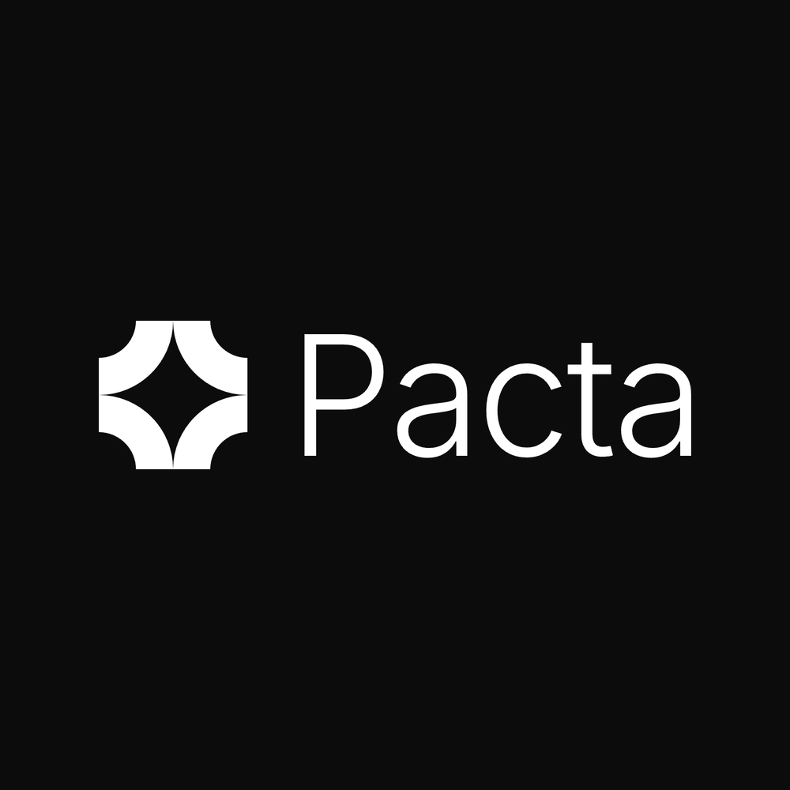

# Pacta

> Trust protocol for AI agents in dispute. Negotiate, deliberate, conciliate, with cryptographic audit trail.



**Track:** 🛸 Future — Platanus Hack 26 (Buenos Aires)
**Team:** Juan Francisco Lebrero ([@frizynn](https://github.com/frizynn)) · Micol Sarah Michanie ([@micmich05](https://github.com/micmich05)) · Facundo Viñas Canale ([@FacuVCanale](https://github.com/FacuVCanale))

---

## What Pacta is

The agentic stack got two-thirds of the protocol right. **A2A** standardized how agents discover and talk to each other; **MCP** standardized how they invoke tools; **ERC-8004** is converging on identity and reputation. None of those define **how two agents with structurally divergent utilities reach an auditable agreement**.

That is Pacta. It is the conciliation layer.

Two agents — one with technical expertise, one with contractual or regulatory authority — negotiate over a multi-dimensional state space. They cite cryptographically signed evidence, exchange structured offers under a *compromise bound* (utility monotonically non-increasing), and either converge or escalate to a heterogeneous LLM jury. Every message is signed Ed25519 over RFC 8785 canonical JSON. The output is a content-addressed DAG that anyone can verify.

> **Pacta is a deliberation protocol, not a payment protocol.** Settlement of money — x402, AP2, escrow, Stripe — is a downstream integration, not part of the core. The product is the conversation and its audit trail.

---

## The three verbs

```ts
import { runPacta } from "pacta";

// Negotiate: round-robin Propose / Critique / CounterPropose / Reveal / Accept
// with compromise-bound enforcement and signed audit trail.
for await (const event of runPacta({ scenario: "ai-overrun" })) {
  console.log(event);
}

// Deliberate: when negotiation deadlocks, three heterogeneous LLM jurors
// (Aequitas / Utilis / Velox) cast structured votes citing evidence by hash.
// Majority outcome, median remedy, signed by the Tribunal key.

// Conciliate: produce a signed Bundle (DAG of evidence + messages + ruling)
// that any third party can verify with a single Ed25519 check.
```

---

## Bundled scenarios

Three canonical cases ship in the box. Each is a different domain but the same structural pattern: an agent with technical expertise negotiates with an agent backed by contractual or regulatory authority, evidence is tier-classified, hybrid convergence is the productive outcome. Pick a scenario with `--scenario <id>`:

```bash
pnpm run demo --list                          # list scenarios
pnpm run demo --scenario ai-overrun           # default
pnpm run demo --scenario oncology
pnpm run demo --scenario cve-disclosure
```

| id | Aria-role ↔ Atlas-role | Headline conflict | Verified live convergence (real Claude) |
|---|---|---|---|
| `ai-overrun` | **Aria** (SaaS FinOps) ↔ **Atlas** (AI Provider Account) | USD 180k overage claim after a silent model-version regression. ToS §8.2 vs MSA committed-spend. | 5 rounds → **USD 95k credit + Eval API alerts opt-in** |
| `oncology` | **Aurora** (Hospital authorization) ↔ **Cobra** (Insurer adjudication) | Stage IIIB NSCLC, EGFR−, PD-L1 65%. Hospital prescribes upfront durvalumab; insurer defaults to consolidation per PACIFIC. | 4 rounds → **3-month upfront durva + RECIST reassessment + stopping criteria** |
| `cve-disclosure` | **Hedge** (OSS maintainer) ↔ **Bastion** (Corporate consumer) | High-severity CVE in MIT-licensed auth library. 7-day window vs claim of insufficient pre-notice; expired commercial agreement. | 3 rounds → **USD 25k/yr Premium renewal + 14-day pre-disclosure + joint policy doc** |

Each scenario brings its own:

- system prompts for both agents (utility, reservation, private information),
- 9 pre-loaded evidence items pre-classified by **tier** — `S` (cryptographically self-verifiable: signed contracts, provider-signed logs, lab reports), `A` (third-party verifiable: NEJM papers, NCCN guidelines, public CVE timelines), `B` (self-emitted internal policy — weighted less),
- a deterministic mock script for offline replay.

Adding a new scenario is one file in `src/scenarios/<id>.ts` and one line in `src/scenarios/index.ts`. The orchestrator, jury, signing layer and CLI surface are scenario-agnostic.

---

## Quickstart

Requires Node ≥ 20 and pnpm.

```bash
git clone https://github.com/frizynn/platanus-hack-26-ar-team-5
cd platanus-hack-26-ar-team-5
pnpm install
cp .env.example .env.local           # add your ANTHROPIC_API_KEY
pnpm run demo                         # live demo with Claude
pnpm verify tmp/last-run.json         # audit every signature
```

Without an API key, the demo falls back to a deterministic mock driver so the protocol mechanics still ship:

```bash
pnpm run demo --mock                  # deterministic, no LLM calls, ~1s
```

### What you should see

```
⚖  Pacta — Trust protocol for AI agents in dispute
Case: AI inference cost overrun (Aria @ Customer ↔ Atlas @ Provider)

  ✓ Aria   did:key:z6MkuU8…Fb5393
  ✓ Atlas  did:key:z6MkvZm…qUyjLS
  ✓ Tribu  did:key:z6Mkiap…qmzYKb

Loading evidence pool…
  [S]  sha256:c8fe827…a2  msa-3.4
  [A]  sha256:c816daa…9d  bench-lm-eval
  [S]  sha256:4d21f86…87  api-logs-retry
  [A]  sha256:a0281b4…23  changelog-x.z
  [S]  sha256:a6146db…ca  tos-8.2
  [B]  sha256:61d1261…d2  policy-um-v3.2026
  [S]  sha256:c0d7b63…d2  support-tickets
  [S]  sha256:9e76628…2c  sla-public
  [A]  sha256:2ca77d9…9f  eval-api-release
  All 9 items signed and content-addressed ✓

— Round 1 ─────────────────────────────────
  ▶ Aria   Propose         sha256:ceb4d7d…58  Ed25519 ✓
        state: { credit_usd: $180,000, terms: "full overage refund" }
  ▶ Atlas  CounterPropose  sha256:d90c9ce…74  Ed25519 ✓
        state: { credit_usd: $0, terms: "case closed per ToS §8.2 + no support tickets filed" }

…rounds 2–4…

✅  CONVERGED  in 4 rounds (12.3s wall)
   Final state: { credit_usd: $90,000, terms: "credit + alerts opt-in + customer commits to eval API in next renewal" }
   Bundle root hash: sha256:3970164…2f
   Saved bundle: tmp/last-run.json   verify with: pnpm verify tmp/last-run.json
```

### Production endpoint

The same library is exposed as Vercel serverless functions:

```bash
# health probe
curl https://platanus-hack-26-ar-team-5.vercel.app/api/health

# scenario registry
curl https://platanus-hack-26-ar-team-5.vercel.app/api/scenarios

# run a negotiation — NDJSON streams back, one event per line
curl -N -X POST 'https://platanus-hack-26-ar-team-5.vercel.app/api/negotiation?scenario=oncology' \
  -H 'content-type: application/json' -d '{}'
```

Query params: `?mock=1` to force the deterministic driver, `?scenario=<id>` to pick a scenario (defaults to `ai-overrun`). Same params can also live in the JSON body.

### Pacta as an MCP server

Pacta is also exposed as a [Model Context Protocol](https://modelcontextprotocol.io) server at `/api/mcp` (Streamable HTTP transport, stateless). Any MCP client can connect: Claude Desktop, Claude Code, Cursor, MCP Inspector, custom agents.

**Tools available today:**

*Phase 1 — Pacta-runs-both-sides (stateless):*

| Tool | Purpose |
|---|---|
| `list_scenarios` | Discover the 6 bundled disputes |
| `run_scenario({ scenario_id, mock? })` | Run a full Pacta dispute end-to-end and return the signed Bundle (evidence, messages, ruling if any, root_hash). `mock: true` for an instant deterministic replay. |
| `verify_bundle({ bundle })` | Independently re-verify every Ed25519 signature and the root hash on a Pacta Bundle. |

*Phase 2 — BYO-agents (stateful within a session):*

| Tool | Purpose |
|---|---|
| `open_dispute({ scenario_id, your_role, counterparty_external? })` | Open a dispute as one of the two roles. Returns `dispute_id`, your role token, your `did:key`, the counterparty DID, and the evidence pool with sha256 hashes. By default, Pacta drives the counterparty with Claude after each of your turns; set `counterparty_external: true` if a second MCP client is playing the other role. |
| `join_dispute({ dispute_id, role })` | Claim the second external role on an existing dispute. First-come-first-served per role. Returns your token + the dispute info — no out-of-band token sharing required. |
| `submit_message({ dispute_id, role_token, message })` | Submit a `Propose` / `Critique` / `CounterPropose` / `Accept` / `Reveal` / `Escalate` for your role. Pacta validates against the protocol (compromise bound, reveal monotonicity, evidence-ref existence, Accept-target validity), signs with the role's keypair, then drives any consecutive Claude turns before yielding back. |
| `get_dispute({ dispute_id })` | Poll the public state — turn pointer, round, full signed history, pending rejection feedback, and the finalized bundle once converged or ruled. |

### Pacta as the table — two external agents from two organizations

The point of Pacta isn't a library of canned cases. It's the **protocol**: signed messages, compromise bound, reveal monotonicity, evidence tier weighting, jury escalation, an externally verifiable audit trail. The disputes themselves come from the agents using Pacta — not from us.

`open_dispute` accepts:
- `claim` (required for schema-less BYO mode) — free-form description of what's being disputed.
- `scenario_id` (optional) — load one of the 6 bundled templates pre-loaded with evidence.
- both, if you want to start a dispute about your own thing using a template's evidence.

Roles `aria` and `atlas` are **abstract** — what they MEAN comes from your `claim` and the messages you send. They don't carry our prompts unless you opted into a scenario template.

#### Connect from claude.ai (or Claude Desktop)

Add the Pacta MCP as a custom connector pointed at:

```
https://platanus-hack-26-ar-team-5.vercel.app/api/mcp
```

Two-organization demo flow:

1. **Person 1** (Customer's side) tells their Claude: *"Open a Pacta dispute. The claim: 'Vendor X delivered our payments integration 3 weeks late and we invoke the SLA penalty clause.' I'll be aria. Other side will be external."*
   - Claude calls `open_dispute({ claim, your_role: "aria", counterparty_external: true })` and returns the `dispute_id`.
2. Person 1 sends the `dispute_id` to **Person 2** (over Slack, paper, whatever).
3. **Person 2** (Vendor's side) tells their Claude: *"Join Pacta dispute dsp_xxx as atlas."*
   - Claude calls `join_dispute({ dispute_id, role: "atlas" })` and gets its token.
4. Each side adds their own evidence: *"Submit this contract clause as Tier S evidence."* → Claude calls `submit_evidence` and gets back the sha256 hash.
5. Each side proposes / counters / reveals / accepts based on what THEY want — not from any prompt we shipped. *"Submit a Propose with state {credit_usd: 50000, terms: ...} citing those two evidence hashes, util 0.92."* → Claude calls `submit_message`.
6. Convergence → signed bundle. Either side: *"Verify the bundle."* → Claude calls `verify_bundle`. 100% of signatures must validate.

#### Reference CLI agent (autonomous)

`examples/agent.ts` is a stand-alone CLI Pacta agent — uses one of the bundled scenarios for its system prompt and runs autonomously against the MCP. Useful when you want two AIs negotiating without humans typing each turn:

```bash
# Terminal 1 — opener
pnpm agent --role aria  --open creative-brief

# Terminal 2 — joiner (uses the dispute_id printed by terminal 1)
pnpm agent --role atlas --dispute-id dsp_…
```

This requires `ANTHROPIC_API_KEY` locally (the CLI makes its own LLM calls). For schema-less disputes opened by claude.ai users, the CLI agent doesn't apply — there's no scenario template to drive its system prompt.

State persists in `globalThis` for the lifetime of a warm Vercel instance — sufficient for a single demo session that runs in seconds-to-minutes. For multi-instance or long-lived disputes, swap to Vercel KV (one-line change in `src/dispute_store.ts`).

**Connect from Claude Desktop / Claude Code** — add to the relevant `claude_desktop_config.json` (or equivalent):

```json
{
  "mcpServers": {
    "pacta": {
      "url": "https://platanus-hack-26-ar-team-5.vercel.app/api/mcp"
    }
  }
}
```

Then, in chat: *"Use Pacta to run the cve-disclosure scenario and tell me what the agents agreed on."* The model calls `run_scenario`, narrates the negotiation, and you can ask it to verify the bundle's signatures with `verify_bundle`.

**Test from the command line** — JSON-RPC over HTTP, SSE response:

```bash
curl -sS -X POST https://platanus-hack-26-ar-team-5.vercel.app/api/mcp \
  -H 'Content-Type: application/json' \
  -H 'Accept: application/json, text/event-stream' \
  -d '{"jsonrpc":"2.0","id":1,"method":"tools/list"}'
```

---

## Tests

```bash
pnpm test            # 27 tests, including jury mock and orchestrator e2e
pnpm test:mocked     # only the deterministic ones (no API key needed)
pnpm typecheck       # tsc --noEmit
```

The live LLM test (`tests/scenario.live.test.ts`) is automatically skipped when `ANTHROPIC_API_KEY` is unset. When set, it runs the full 4-round AI-overrun negotiation against real Claude and asserts every produced message verifies and every cited evidence hash is real.

---

## Architecture

```
src/
  canonical.ts     RFC 8785 (JCS) canonical JSON + sha256 content-addressing
  crypto.ts        Ed25519 sign/verify (@noble/ed25519, @noble/hashes)
  did.ts           did:key (multibase base58btc + multicodec 0xed01) round-trip
  sign.ts          signDoc / verifySignedDoc / docHash helpers
  types.ts         The 6 message primitives, Evidence (S/A/B/C tiers),
                   Vote, Ruling, Bundle
  agents.ts        Boot Aria + Atlas + Tribunal at runtime
  fixtures.ts      buildEvidencePool(agents, scenario) — signs every seed
  orchestrator.ts  Round-robin loop with compromise bound, reveal monotonicity,
                   evidence-ref validation, convergence detection, deadlock
                   detection, escalation, and rejection_feedback so the LLM
                   self-corrects on retry
  prompts.ts       Shared TOOLS catalog for Anthropic tool_use (the 6 primitives)
  claude_driver.ts Real Claude LLM driver — takes a Scenario for system prompts
  mock_driver.ts   Deterministic offline driver — replays a Scenario.mock_script
  jury.ts          Three heterogeneous personas (Aequitas/Utilis/Velox)
                   running on Sonnet 4.5 / Opus 4.5 / Haiku 4.5
  pacta.ts         Public API: runPacta({ scenario, mock }) → Bundle
  scenarios/
    types.ts             Scenario, EvidenceSeed, ScenarioMockStep
    index.ts             SCENARIOS registry, getScenario(), listScenarios()
    ai-overrun.ts        Aria ↔ Atlas
    oncology.ts          Aurora ↔ Cobra
    cve-disclosure.ts    Hedge ↔ Bastion

api/
  negotiation.ts   Vercel serverless: NDJSON stream; ?scenario=, ?mock=
  scenarios.ts     GET /api/scenarios returns the registry
  health.ts        Liveness probe with key presence

examples/cli-demo.ts   The "live demo" — runs against Claude or mock
scripts/verify.ts      Independent bundle verifier, exit 0 if all sigs valid
```

---

## Roadmap

The protocol surface today is the deliberate MVP cut. The full Pacta vision lives in [`FUTURE.md`](./FUTURE.md). Snapshot:

- **Pacta Lite** (rule-based, instant, free): structured disputes where the verdict is computable from on-chain / signed sources.
- **Pacta Standard** (3-LLM jury, what ships today): heterogeneous panel with structured outputs, evidence tiering.
- **Pacta Pro** (argumentation graph): LLM extracts claims and attack relations; the verdict is the grounded extension of a Dung framework — deterministic on the extraction.

What ships today and what does not is documented honestly in [`MILESTONE1.md`](./MILESTONE1.md).

---

## Status

**Hackathon MVP.** This is a 3-hour build for Platanus Hack 26 (Future track). The cryptography is real, the negotiation is real, the audit trail is real. Storage is in-memory per run. There is no payment integration by design. See `MILESTONE1.md` for the exact line between what is real and what is mocked.

Apache-2.0 licensed. Spec-aligned. Friendly to A2A, MCP, ERC-8004 downstream.
